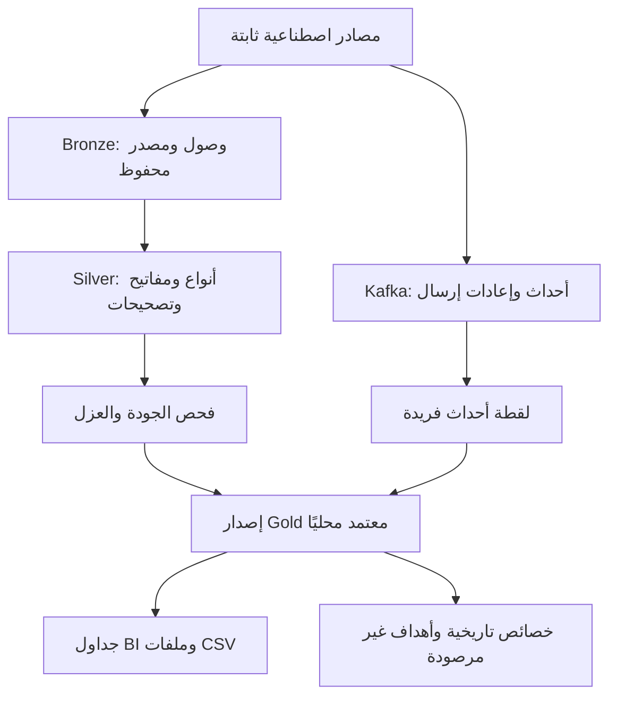

# مسار المصغّر — مشروع هندسة البيانات الحديثة

**إعداد: سلطان المطيري**

[فرع المشروع في GitHub](https://github.com/sgmutairi-sys/masar-modern-data-engineering/tree/develop) · [خطوات الاستكمال](FINISH_SUBMISSION_AR.md)

أُنجز هذا المشروع ضمن برنامج هندسة البيانات الحديثة لأنظمة الذكاء الاصطناعي (SDA-DSC-214) لدى [أكاديمية سدايا](https://github.com/SDAIAAcademy). `#SDAIAAcademy`

**التنفيذ:** طُبّقت اللابات التراكمية 01–08 على بيانات الرحلات والسائقين والمواقع الاصطناعية `MASAR_SMALL_V1`، لبناء خط بيانات من Bronze إلى Silver ثم Gold باستخدام Spark وDelta Lake، مع مسار تحويل مقارن باستخدام dbt، واستقبال أحداث المواقع عبر Kafka، وفحص الجودة باستخدام Great Expectations، وتجهيز جداول BI وخصائص للذكاء الاصطناعي. توثق التقارير المقدمة تشغيل هذه المراحل في جلسة Colab مع تهيئة محلية لـKafka وموصل Spark.

**النتائج الفعلية:** انتهى التشغيل إلى 75 رحلة و217 حدث موقع فريدًا، بإجمالي أجور 1,880.60 ريالًا. عُزلت 7 سجلات غير مطابقة من مرشح جودة مكوّن من 82 سجلًا، واجتاز 75 سجلًا إعادة الفحص. أُنتجت ثمانية جداول مع صادرات CSV، وثلاثة صفوف خصائص للذكاء الاصطناعي؛ وبقيت الأهداف بحالة `UNOBSERVED`. تستند هذه الأرقام إلى تقارير التشغيل وملفات المخرجات المقدمة، وترد تفاصيل التحقق أدناه.

**حدود المشروع:** التنفيذ تجربة تعليمية محلية على بيانات اصطناعية صغيرة؛ لا يثبت جاهزية إنتاجية أو أداءً موزعًا أو تحمل أعطال Kafka، ولا يتضمن نموذج ذكاء اصطناعي مدربًا أو قياس دقة تنبؤ. تهيئة Colab خاصة بهذه الجلسة، والقياسات المحلية لا تُعمّم على البيئات السحابية. تبقى إضافة نسخ الدفاتر المنفذة ورابط الأرشيف الكامل وإثبات إعادة التشغيل من نسخة نظيفة مطلوبة لاستكمال التسليم، كما توضح [قائمة الاستكمال](SUBMISSION_STATUS.md).

بُني المشروع على مواد الدورة وقوالبها التي أعدّتها **ميعاد المري** في [مستودع الدورة](https://github.com/almiyead-rgb/masar-modern-data-engineering). يصف هذا التوثيق نتائج حزمة التشغيل المقدمة للمراجعة، ويفصل النتائج المرصودة عن حدود التنفيذ. حُفظ تعريف الدورة الأصلي في [COURSE_README.md](COURSE_README.md)، وتبقى نسب المصادر وملفات الترخيص الأصلية محفوظة في المستودع.

## فكرة المشروع

خط بيانات تعليمي لفريق عمليات افتراضي يستقبل الرحلات والسائقين وأحداث المواقع. يستقبل البيانات في Bronze، ويوحدها ويعالج تكرارها وتصحيحاتها في Silver، ويفحص جودتها، ثم ينتج جداول Gold ومخرجات للتقارير وخصائص تاريخية للذكاء الاصطناعي. اللابات 01–08 أجزاء المشروع التراكمي نفسه.

## البيانات

البيانات **اصطناعية بالكامل**، من المجموعة الثابتة `MASAR_SMALL_V1` في `data/masar-small-v1/`. تضم البداية 72 رحلة و6 سائقين و216 حدث موقع؛ ثم تُضاف الدفعات التعليمية المتأخرة والتصحيحات وإعادة الإرسال وفق ترتيب اللابات. لا تمثل المعرفات أو المواقع أشخاصًا أو رحلات حقيقية.

بصمة سجل البيانات SHA-256 التي تتفق عليها التقارير:

```text
20a7e45bed2980b9394c10e8532da3b9f40f614366bb2df26a88610253e768e3
```

## البيئة المستخدمة وحدود توثيقها

تشير مسارات التشغيل في تقارير الصيانة إلى Google Colab تحت `/content/masar-modern-data-engineering`. البيئة المعتمدة في دليل الدورة Ubuntu مع Python 3.11 وJava 17؛ أما تهيئة Colab فكانت معالجة خاصة بهذه الجلسة، وليست اختبارًا عامًا لاعتماد Colab.

| المكون | الإصدار | أساس التوثيق |
|---|---|---|
| Python | 3.11.13 | مرصود في تقرير محاولة dbt |
| Java | 17.0.20 | مرصود في فحص البيئة المحفوظ لمحاولة dbt |
| PySpark | 3.5.8 | مثبت في تقارير المحرك وفحص dbt |
| Delta Lake | 3.3.3 | سجل معاملات اليوم الثالث وفحص dbt |
| dbt-core / dbt-spark | 1.9.8 / 1.9.1 | مرصودان في تقرير dbt |
| Great Expectations | 1.7.0 | مرصود في تقارير GX |
| Kafka / kafka-python | 4.0.2 / 2.2.15 | إصدارات إعداد الدورة وحل التهيئة؛ التقرير يثبت تنفيذ Kafka دون تسجيل إصدار الوسيط |
| pandas | 2.2.3 | الإصدار المحدد في متطلبات اليوم الرابع؛ لم يُرفق فحص مستقل لإصداره |

لم تُرفق مواصفات CPU والذاكرة الدقيقة أو SHA لتعديل الكود وقت التشغيل. لا يُستنتج أي منهما من اسم مساحة العمل أو معرّف تشغيل اللاب.

## المعمارية



ينفّذ مسار dbt المقارن التحويلات في مساحة منفصلة عن Silver التراكمية. تفاصيل الاختيارات في [DECISIONS.md](DECISIONS.md)، وحدود الصلاحيات والاحتفاظ في [GOVERNANCE.md](GOVERNANCE.md).

## استنساخ المشروع والتحقق من الأدلة المحفوظة

```bash
git clone --branch develop https://github.com/sgmutairi-sys/masar-modern-data-engineering.git masar-review
cd masar-review
python3 scripts/verify_submission_evidence.py
git rev-parse HEAD
```

على Windows يستخدم `py -3.11 scripts/verify_submission_evidence.py` بدل `python3`. يتحقق السكربت بالمكتبة القياسية من بصمات 171 ملف دليل أصليًا، وبصمات ملفات المصدر العشرة، وصادرات CSV الثمانية، وتسوية الرحلات والأجور والأحداث والمدد. [نتيجة الفحص المحفوظة](reports/review/retained_artifact_verification.json) تعرض فروقًا صفرية. نُفذ هذا الفحص على الملفات المحلية المطابقة للمحتوى المعد للنشر؛ **لم يُنفذ المسار الكامل من استنساخ نظيف**، ولا يختبر السكربت Spark أو Kafka أو dbt أو اكتمال الدفاتر.

## ترتيب التشغيل

ابدأ من مستودع الدورة الكامل، واتبع [إعداد البيئة](docs/SETUP.md). بعد تفعيل بيئة Python 3.11 وتوفر Java 17:

```bash
python -m pip install -r requirements-course.txt -r requirements-day01.txt
python -m pip check
python -m jupyterlab
```

| الترتيب | الدفتر | اللابات | الملاحظات |
|---|---|---|---|
| 1 | `day01/STUDENT.ipynb` | 01 و02 | [LAB01](LAB01_NOTES.md)، [LAB02](LAB02_NOTES.md) |
| 2 | `day02/STUDENT.ipynb` | 03a و03b وdbt، ضمن اللاب 03 | [LAB03](LAB03_NOTES.md) |
| 3 | `day03/STUDENT.ipynb` | 04a و04b، ضمن اللاب 04 | [LAB04](LAB04_NOTES.md) |
| 4 | `day04/STUDENT.ipynb` | 05 و06 | [LAB05](LAB05_NOTES.md)، [LAB06](LAB06_NOTES.md) |
| 5 | `day05/STUDENT.ipynb` | 07 و08 | [LAB07](LAB07_NOTES.md)، [LAB08](LAB08_NOTES.md) |

قبل اليوم الرابع، يتطلب مسار الدورة على المضيف المجهز تشغيل Kafka وفق [إعداد اليوم الرابع](day04/SETUP.md):

```bash
docker compose -f infrastructure/kafka/compose.yaml up -d --wait --wait-timeout 120
python scripts/run_day04.py --preflight
```

تُنفّذ هذه الأوامر في بيئة المضيف المجهز. في تشغيل Colab محل المراجعة أُعدّ وسيط Java محلي، ثم شُغّل تمرين التدفق في عملية Python جديدة لتحميل موصل Spark–Kafka منذ البداية. يجب الاحتفاظ بخلايا هذا التعديل داخل دفتر اليوم الرابع المنفذ؛ نسخة الدفتر الموجودة حاليًا في المستودع مرجعية؛ يلزم استبدالها بنسخة تشغيل Colab الفعلية. لا تعاود اليوم الثاني على جدول Silver المصحح لليوم الثالث، ولا تعاود نشر رسائل قديمة لمجرد إعادة إنشاء التقارير.

## النتائج الفعلية

| المرحلة | النتيجة المرصودة |
|---|---|
| Bronze | 144 سجل وصول للرحلات تمثل 72 رحلة فريدة؛ 6 سائقين و216 حدثًا |
| Silver بعد الوصول المتأخر | 75 رحلة؛ إجمالي 1,875.60 ريالًا |
| Silver بعد التصحيح | 75 رحلة؛ إجمالي 1,880.60 ريالًا؛ `SYN_T0001` من 18.00 إلى 23.00 |
| dbt | `PASSED_DBT_NATIVE`؛ أعداد المراحل 72، 72، 75، 75؛ ستة نماذج وثلاثة مصادر موثقة بحسب سجل الأمر |
| Kafka | سجلات الوصول 216، 216، 218، 219؛ الأحداث الفريدة 216، 216، 216، 217 |
| الجودة | 82 صفًا في المرشح المختلط؛ عزل 7 وإعادة فحص 75 صفًا قبل الاعتماد |
| Gold وBI | ثمانية جداول؛ 75 رحلة و217 حدثًا مرتبطًا؛ مجموع مدد الرحلات 95,400 ثانية |
| AI | ثلاثة صفوف خصائص؛ ثلاثة أهداف بحالة `UNOBSERVED` وقيم أهداف فارغة |
| الأداء المحلي | وسيط CSV: 0.311422 ثانية؛ وسيط Delta v0: 2.133406 ثانية لعينة متساوية من 72 صفًا |

| المدينة | الرحلات | الأجور بالريال | أحداث المواقع الفريدة المرتبطة |
|---|---:|---:|---:|
| الرياض | 25 | 585.00 | 73 |
| جدة | 25 | 625.20 | 72 |
| الدمام | 25 | 670.40 | 72 |
| **الإجمالي** | **75** | **1,880.60** | **217** |

توجد تفاصيل الأدلة ومعرفات التشغيل في [RUN_EVIDENCE.md](RUN_EVIDENCE.md)، والقياسات وحدودها في [BENCHMARKS.md](BENCHMARKS.md). تمت مطابقة 107 مراجع لبصمات الملفات داخل الأرشيف، وملفات CSV الثمانية مع بصماتها وأعدادها. هذه مراجعة للملفات المقدمة، وليست إعادة تنفيذ مستقلة للمحركات.

## المخرجات المحفوظة

[فهرس حزمة المخرجات وبصمتها وروابط الوصول](OUTPUT_ARTIFACT.md). يضم الأرشيف الأساسي `day05_handoff.zip` لقطات Delta والتقارير والإصدارات وملفات CSV ونقاط تحقق Spark. لا يضم دفاتر المستخدم أو ملاحظاته أو مساحة dbt المنفصلة أو تخزين وسيط Kafka.

**الأدلة القابلة للفحص الآن:** [التقارير والمخرجات الصغيرة](reports/README.md) محفوظة في المستودع استجابة لملاحظات التقييم. رابط مشاركة الأرشيف الكامل لم يُقدّم بعد؛ تبقى ملفات ZIP وParquet خارج Git ويجب إضافة رابطها المعتمد في `OUTPUT_ARTIFACT.md` قبل التسليم.

## حدود المشروع وحالة الاستكمال

- أثبتت التقارير تشغيل المسارات التعليمية وتساوي النتائج في السيناريوهات المحددة؛ لم تثبت نشرًا إنتاجيًا أو توسعًا موزعًا أو تحمل أعطال وسيط Kafka.
- تقليل ملفات Delta من 4 إلى 1 لا يثبت تحسن زمن الاستعلام. القياس المحلي لا يثبت تكلفة سحابية أو تفوق صيغة تخزين عمومًا.
- ملفات الخصائص والأهداف ليست نموذجًا مدربًا، ولم تُحسب دقة تنبؤ، ولم يُثبت تشغيل موصل Power BI.
- تُعتمد جداول الإصدار كلٌ بمعاملته؛ مؤشر الإصدار ليس معاملة ذرية واحدة للجداول الثمانية.
- أُتيحت التقارير الصغيرة، ومخرجات فحص المصدر والتكلفة، وتوثيق dbt، وخطط Spark، وسجلات الإزاحات، ونتائج GX، وصادرات CSV في [فهرس الأدلة](reports/README.md). تبقى الدفاتر الخمسة المنفذة، ورابط الأرشيف الكامل، وإعادة تشغيل موثقة من نسخة نظيفة، وإجراءات التسليم النهائية. التفاصيل في [SUBMISSION_STATUS.md](SUBMISSION_STATUS.md).

## المراجع والنسب

[مواد الدورة — ميعاد المري](https://github.com/almiyead-rgb/masar-modern-data-engineering)، [قوالب الدورة](templates/LAB_NOTES.md)، [تعريفات مخرجات البيانات](day05/DATA_PRODUCTS.md)، [المصادر الأصلية](SOURCES.md)، [دليل التسليم](project/SUBMISSION.md). وثائق الملاحظات والقرارات هنا مشتقة من القوالب الأصلية ومعبأة بالأدلة المقدمة، مع التصريح بما لم يصل ضمن الحزمة.
